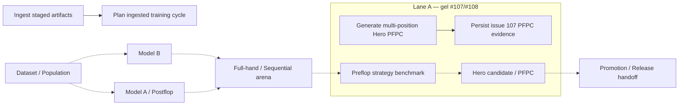
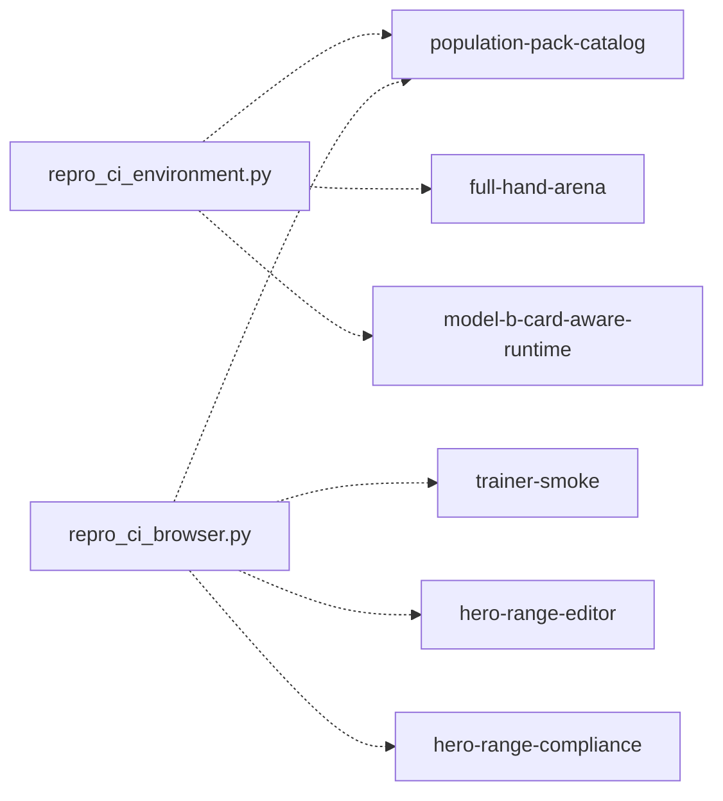

# Audit GitHub Actions — #204 phase 1

Snapshot structurel rafraîchi sur `4559315b08fd224409c5469a4073e07ee89225b3` (origin/main au démarrage de la tranche finale #204). Cette phase est **audit-only** : aucun fichier `.github/workflows/**` n'est modifié, aucun gate scientifique n'est déclenché ou relâché.

## Résumé

- **69 workflows** au HEAD ; **54** portent au moins un trigger automatique (`push`, `pull_request`, `workflow_run`, …) et **15** sont manual-only (`workflow_dispatch` uniquement, quarantaine historique #373).
- **38** groupes avec `cancel-in-progress: true`, **12** avec `false`, **19** sans bloc concurrency.
- Duplication statique : **115 checkouts**, **70 setup-python**, **8 setup-node**, **8 installs pip**, **8 installs Playwright**, **53 uploads** et **43 téléchargements d'artefacts**.
- Le snapshot précédent (`360d02225ff4ca0aca798f07e3abb87304be88ae`) portait 54 workflows ; l'écart vient de 15 workflows ajoutés, des migrations REPRO composites (#378/#384) et de la mise en manual-only des 15 candidats historiques (#373).
- Les observations de runs des 100 derniers événements restent celles de `analysis/workflow_audit/baseline_metrics.json` (échantillon #242, preuve gelée) : 80 terminés, 10 annulés, soit **12,5 % d'annulation** ; `sequential-arena.yml` 24/100 runs, 8 annulations sur 18 terminés.
- 9 couples workflow/branche ont vu à la fois un run `push` et un run `pull_request` dans cet échantillon #242.

Les fichiers machine-readable sont `analysis/workflow_audit/workflows.json` et `analysis/workflow_audit/baseline_metrics.json`. L'outil `tools/audit_github_workflows.py --inventory analysis/workflow_audit/workflows.json` régénère l'inventaire complet depuis un checkout et extrait les filtres `paths` exacts ; `--json` produit la vue détaillée (`poker-engine-workflow-audit/v1`).

## Matrice des workflows

| Workflow | Rôle | Triggers | Scopes de paths | Concurrency | Coût approx. | Cycle |
|---|---|---|---|---|---|---|
| `analysis-state-contract.yml` | validation_or_utility | push, pull_request | `.github`, `contracts`, `docs`, `site`, `src`, `tests` | `analysis-state-contract-${{ github.ref }}` | low (7) | current |
| `continuous-training-cycle.yml` | training_orchestration | push, pull_request, workflow_dispatch | `.github`, `tests`, `tools`, `training` | `continuous-training-cycle-${{ github.ref }}` | medium (13) | current |
| `dataset-integrity.yml` | dataset_population | push, pull_request, workflow_dispatch | `.github`, `.python-version`, `package-lock.json`, `reproducibility`, `requirements.lock.txt`, `tests`, `tools`, `training` | `${{ github.workflow }}-${{ github.event.pull_request.number || github.ref }}` | low (3) | current |
| `finalize-training-cycle.yml` | training_orchestration | workflow_dispatch | branch/manual | `finalize-training-cycle-${{ github.ref }}` | low (7) | historical_candidate |
| `full-hand-arena.yml` | simulation_benchmark | pull_request, workflow_dispatch | `.github`, `.node-version`, `.python-version`, `docs`, `package-lock.json`, `reproducibility`, `requirements.lock.txt`, `tests`, `tools`, `training` | — | medium (12) | current |
| `full-hand-protocol.yml` | simulation_benchmark | pull_request, push, workflow_dispatch | `.github`, `.python-version`, `package-lock.json`, `reproducibility`, `requirements.lock.txt`, `tests`, `tools`, `training` | — | low (5) | current |
| `game-core.yml` | simulation_benchmark | pull_request, workflow_dispatch | `.github`, `.python-version`, `analysis`, `docs`, `package-lock.json`, `reproducibility`, `requirements.lock.txt`, `tests`, `tools` | — | low (5) | current |
| `hero-calculated-range-export.yml` | hero_preflop | pull_request, workflow_dispatch | `.github`, `.node-version`, `.python-version`, `docs`, `package-lock.json`, `reproducibility`, `requirements.lock.txt`, `site`, `src`, `tests`, `tools`, `training` | — | low (5) | current |
| `hero-full-169-evidence.yml` | hero_preflop | pull_request, workflow_dispatch | `.github`, `tools`, `training` | `hero-full-169-${{ github.event.pull_request.number || github.ref }}` | high (30) | frozen_current |
| `hero-pfpc-evidence-validation.yml` | hero_preflop | pull_request, push | `.github`, `tests`, `tools`, `training` | — | low (5) | frozen_current |
| `hero-population-strategy.yml` | hero_preflop | push, pull_request | `.github`, `site`, `src`, `tests`, `tools` | `hero-population-strategy-${{ github.ref }}` | low (5) | current |
| `hero-range-compliance.yml` | product_browser_validation | push, pull_request | `.github`, `site`, `tests`, `tools` | `hero-range-compliance-${{ github.ref }}` | low (6) | current |
| `hero-range-editor.yml` | product_browser_validation | push, pull_request | `.github`, `site`, `tests`, `tools` | `hero-range-editor-${{ github.ref }}` | low (6) | current |
| `hero-range-pfc-context.yml` | hero_preflop | workflow_dispatch, pull_request, push | `.github`, `.node-version`, `.python-version`, `package-lock.json`, `reproducibility`, `requirements.lock.txt`, `site`, `tests`, `tools`, `training` | `hero-range-pfc-context-${{ github.ref }}` | low (7) | current |
| `hero-unopened-multiposition-generation.yml` | hero_preflop | workflow_dispatch, push | branch/manual | `hero-unopened-multiposition-${{ github.ref }}` | high (47) | frozen_current |
| `ingest-artifacts.yml` | dataset_population | push | `.github`, `.node-version`, `.python-version`, `artifacts`, `package-lock.json`, `reproducibility`, `requirements.lock.txt`, `tests`, `tools`, `training` | `artifact-ingest-${{ github.ref }}` | low (5) | current |
| `issue-358-hero-preflop-generation.yml` | hero_preflop | push | `.github` | `issue-358-hero-preflop-generation` | high (34) | current |
| `issue-367-real-iso-ev-observable.yml` | validation_or_utility | pull_request | `.github` | `issue-367-real-iso-ev-observable-${{ github.sha }}` | low (7) | current |
| `issue-367-real-iso-ev.yml` | validation_or_utility | pull_request, push | `.github`, `tests`, `tools`, `training` | `issue-367-real-iso-ev-${{ github.event_name }}-${{ github.ref }}` | medium (12) | current |
| `materialize-certified-population.yml` | dataset_population | push, pull_request | `.github`, `tests`, `tools`, `training` | `materialize-certified-population-${{ github.ref }}` | medium (11) | current |
| `model-a-continuation.yml` | validation_or_utility | pull_request, push, workflow_dispatch | `.github`, `.python-version`, `analysis`, `package-lock.json`, `reproducibility`, `requirements.lock.txt`, `tests`, `tools`, `training` | — | low (5) | current |
| `model-b-aggressive-tail.yml` | model_b | workflow_dispatch, push | `.github`, `tests`, `tools`, `training` | `model-b-aggressive-tail-issue-298` | low (7) | current |
| `model-b-build.yml` | model_b | workflow_dispatch | branch/manual | `model-b-build-${{ github.ref }}` | low (7) | historical_candidate |
| `model-b-card-aware-fit.yml` | model_b | workflow_dispatch, push | `.github`, `tests`, `tools`, `training` | `model-b-card-aware-fit-${{ github.ref }}` | medium (9) | current |
| `model-b-card-aware-runtime.yml` | model_b | push, pull_request | `.github`, `.node-version`, `.python-version`, `package-lock.json`, `reproducibility`, `requirements.lock.txt`, `tests`, `tools`, `training` | — | low (3) | current |
| `model-b-conditioned-runtime.yml` | model_b | workflow_dispatch | branch/manual | — | low (5) | historical_candidate |
| `model-b-evaluation.yml` | model_b | workflow_dispatch | branch/manual | `model-b-evaluation-${{ github.ref }}` | medium (8) | historical_candidate |
| `model-b-features.yml` | model_b | workflow_dispatch | branch/manual | `model-b-features-${{ github.ref }}` | low (3) | historical_candidate |
| `model-b-observed-vs-simulated-calibration.yml` | model_b | workflow_dispatch, push | `.github`, `tests`, `tools`, `training` | `model-b-observed-vs-simulated-calibration-issue-272` | low (7) | current |
| `model-b-preflop-response-price-2a.yml` | model_b | workflow_dispatch, pull_request, push | `.github`, `tests`, `tools`, `training` | `${{ github.workflow }}-${{ github.event_name }}-${{ github.ref }}` | low (7) | current |
| `model-b-preflop-response-price-scaffold.yml` | model_b | workflow_dispatch, push | `.github`, `tests`, `tools`, `training` | `model-b-preflop-response-price-scaffold-315` | low (7) | current |
| `model-b-preflop-sensitivity-harness.yml` | model_b | workflow_dispatch, pull_request, push | `.github`, `contracts`, `docs`, `tests`, `tools`, `training` | `${{ github.workflow }}-${{ github.event_name }}-${{ github.ref }}` | low (7) | current |
| `model-b-profile-selection.yml` | model_b | workflow_dispatch | branch/manual | `model-b-profile-selection-${{ github.ref }}` | low (3) | historical_candidate |
| `model-b-response-audit.yml` | model_b | workflow_dispatch, push | `.github`, `tests`, `tools` | — | low (5) | current |
| `model-b-response-to-price-evaluation.yml` | model_b | workflow_dispatch, push | `.github`, `tests`, `tools`, `training` | `model-b-response-to-price-issue-197` | medium (16) | current |
| `model-b-response-v3.yml` | model_b | workflow_dispatch | branch/manual | `model-b-response-v3-${{ github.ref }}` | low (5) | historical_candidate |
| `model-b-reveal-aware.yml` | model_b | pull_request, workflow_dispatch | `.github`, `.node-version`, `.python-version`, `package-lock.json`, `reproducibility`, `requirements.lock.txt`, `tests`, `tools`, `training` | — | low (5) | current |
| `model-b-support-aware-backoff.yml` | model_b | workflow_dispatch, push | `.github`, `tests`, `tools`, `training` | `model-b-support-aware-backoff-issue-286` | low (7) | current |
| `persist-issue-107-pfpc.yml` | validation_or_utility | workflow_run, pull_request, push | `.github` | `persist-issue-107-pfpc-d7ec5e532dc5` | medium (10) | frozen_current |
| `plan-ingested-cycle.yml` | dataset_population | workflow_run, push, pull_request, workflow_dispatch | `.github`, `tests`, `tools`, `training` | `plan-ingested-cycle-${{ github.event_name == 'workflow_run' && 'main' || github.ref }}` | medium (11) | current |
| `population-certification.yml` | dataset_population | push, pull_request, workflow_dispatch | `.github`, `tests`, `tools`, `training` | — | medium (8) | current |
| `population-pack-catalog.yml` | product_browser_validation | pull_request, workflow_dispatch | `.github`, `.node-version`, `.python-version`, `analysis`, `package-lock.json`, `reproducibility`, `requirements.lock.txt`, `site`, `tests`, `tools`, `user`, `wrangler.jsonc` | `population-pack-catalog-${{ github.ref }}` | medium (8) | current |
| `population-pack-real-admission-audit.yml` | validation_or_utility | pull_request, push | `.github`, `tests`, `tools`, `training` | `${{ github.workflow }}-${{ github.event_name }}-${{ github.ref }}` | medium (8) | current |
| `population-pack.yml` | validation_or_utility | pull_request, push, workflow_dispatch | `.github`, `site`, `tests`, `tools`, `training`, `user` | — | medium (13) | current |
| `postflop-response-refit.yml` | validation_or_utility | push, pull_request, workflow_dispatch | `.github`, `.node-version`, `.python-version`, `package-lock.json`, `reproducibility`, `requirements.lock.txt`, `tests`, `tools`, `training` | `postflop-continuation-${{ github.ref }}` | low (7) | current |
| `preflop-contract.yml` | preflop_strategy | pull_request, workflow_dispatch | `.github`, `.node-version`, `.python-version`, `analysis`, `package-lock.json`, `reproducibility`, `requirements.lock.txt`, `site`, `src`, `tests`, `tools` | — | low (7) | current |
| `preflop-grid-evaluator.yml` | preflop_strategy | pull_request, workflow_dispatch | `.github`, `.node-version`, `.python-version`, `docs`, `package-lock.json`, `reproducibility`, `requirements.lock.txt`, `src`, `tests`, `tools` | — | low (3) | current |
| `preflop-policy169.yml` | preflop_strategy | pull_request, workflow_dispatch | `.github`, `.python-version`, `package-lock.json`, `reproducibility`, `requirements.lock.txt`, `tests`, `tools`, `training` | `preflop-policy169-${{ github.ref }}` | low (5) | current |
| `preflop-search.yml` | preflop_strategy | push, pull_request | `.github`, `.node-version`, `.python-version`, `docs`, `package-lock.json`, `reproducibility`, `requirements.lock.txt`, `src`, `tests`, `tools` | `preflop-search-${{ github.ref }}` | low (3) | current |
| `preflop-strategy-benchmark-v2.yml` | preflop_strategy | workflow_dispatch, pull_request, push | `.github`, `tests`, `tools`, `training` | `preflop-strategy-benchmark-v2-${{ github.ref }}` | low (7) | frozen_current |
| `preflop-strategy-support-closed.yml` | preflop_strategy | workflow_dispatch | branch/manual | `preflop-strategy-support-closed-${{ github.ref }}` | low (7) | historical_candidate |
| `preflop-strategy-test-pfpc.yml` | preflop_strategy | pull_request, push | `.github`, `tests`, `tools` | `preflop-strategy-pfpc-test-20260918` | high (46) | frozen_current |
| `preflop-strategy-validation-pfpc.yml` | preflop_strategy | pull_request, push | `.github`, `tests`, `tools` | `preflop-strategy-pfpc-validation-20260918` | high (41) | frozen_current |
| `preflop-strategy-validation-support-closed.yml` | preflop_strategy | workflow_dispatch | branch/manual | `preflop-strategy-validation-support-closed-${{ github.ref }}` | high (31) | historical_candidate |
| `preflop-strategy-validation-v2.yml` | preflop_strategy | workflow_dispatch | branch/manual | `preflop-strategy-validation-v2-${{ github.ref }}` | high (31) | historical_candidate |
| `preflop-topology-contract.yml` | preflop_strategy | push, pull_request, workflow_dispatch | `.github`, `.python-version`, `analysis`, `package-lock.json`, `reproducibility`, `requirements.lock.txt`, `tests`, `tools`, `training` | — | low (5) | current |
| `project-state-consistency.yml` | validation_or_utility | pull_request, push | branch/manual | — | low (5) | current |
| `promotion-gate-final.yml` | release_promotion | workflow_dispatch | branch/manual | — | low (5) | historical_candidate |
| `recover-issue-107-pfpc.yml` | validation_or_utility | pull_request, push | `.github` | `recover-issue-107-pfpc-d7ec5e532dc5` | high (22) | frozen_current |
| `release-handoff-contract.yml` | release_promotion | pull_request, push | `.github`, `.python-version`, `package-lock.json`, `reproducibility`, `requirements.lock.txt`, `tests`, `tools`, `training` | `release-handoff-contract-${{ github.ref }}` | low (3) | current |
| `release-no-pending-snapshot-proof.yml` | release_promotion | pull_request, push | `.github`, `.python-version`, `package-lock.json`, `reproducibility`, `requirements.lock.txt`, `tools` | `release-no-pending-snapshot-proof-20260918` | medium (10) | current |
| `repro-scientific-environment.yml` | validation_or_utility | workflow_call, pull_request, push | `.github`, `.node-version`, `.python-version`, `package-lock.json`, `package.json`, `reproducibility`, `requirements.in`, `requirements.lock.txt`, `tests`, `tools` | `repro-scientific-environment-${{ github.workflow }}-${{ github.event.pull_request.number || github.ref }}` | medium (9) | current |
| `sequential-arena.yml` | simulation_benchmark | push, pull_request | `.github`, `site`, `tests`, `tools`, `training` | `sequential-arena-${{ github.ref }}` | high (41) | current |
| `strategic-benchmark-v3.yml` | simulation_benchmark | workflow_dispatch | branch/manual | `strategic-benchmark-v3-${{ github.ref }}` | high (39) | historical_candidate |
| `strategy-candidate-v84.yml` | preflop_strategy | workflow_dispatch | branch/manual | `strategy-candidate-v84-${{ github.ref }}` | medium (16) | historical_candidate |
| `trainer-smoke.yml` | product_browser_validation | push, pull_request | `.github`, `site`, `tests`, `tools`, `wrangler.jsonc` | `trainer-smoke-${{ github.ref }}` | medium (8) | current |
| `unseen-preflop-context-audit.yml` | preflop_strategy | workflow_dispatch | branch/manual | — | low (7) | historical_candidate |
| `user-artifact-bundle.yml` | validation_or_utility | pull_request, push, workflow_dispatch | `.github`, `tools`, `training`, `user` | — | medium (8) | current |
| `v84-strategy-candidate.yml` | preflop_strategy | workflow_dispatch | branch/manual | `v84-strategy-${{ github.ref }}` | high (36) | historical_candidate |

Le score de coût est un **proxy structurel**, pas une estimation de facturation GitHub : jobs + setup + browser install + transfert d'artefacts, avec pondération des workflows scientifiques.

### Rafraîchissement concurrent

Le snapshot a été régénéré par `python3 tools/audit_github_workflows.py --inventory analysis/workflow_audit/workflows.json` sur `4559315b08fd224409c5469a4073e07ee89225b3`. Les **69** fichiers `.github/workflows/*.yml` du HEAD sont couverts (**54** automatiques, **15** manual-only). Le DAG actif (`analysis/workflow_audit/active_workflow_dag_v2.json`, `docs/ci-workflow-dag.md`) est régénéré depuis la base `4559315b08fd224409c5469a4073e07ee89225b3` avec un `inventory_sha256` calculé sur ce fichier : son ensemble actif est exactement l'ensemble des workflows à trigger automatique, les 15 manual-only étant exclus explicitement.

> Traçabilité : le brief de la tranche annonçait 68 fichiers. Le HEAD `4559315…` en contient **69** — le 69e, `.github/workflows/hero-population-strategy.yml`, a été ajouté par #392 (`8ea785e`) avant le début de la tranche. L'inventaire suit le HEAD réel, pas le décompte du brief.

## Duplications observées

| Primitive | Occurrences |
|---|---:|
| checkout | 115 |
| setup-python | 70 |
| setup-node | 8 |
| pip install | 8 |
| Playwright install | 8 |
| npm install/ci | 0 |
| upload-artifact | 53 |
| download-artifact / gh run download | 43 |

Les répétitions les plus rentables à factoriser après dégel sont : setup Python verrouillé (#203), installation Playwright/Chromium, browser smoke statique, upload/download fan-out/fan-in et capture d'identité d'environnement.

## Concurrency : collisions et annulations

1. Les groupes du type `<workflow>-${{ github.ref }}` annulent efficacement des pushes successifs d'une même ref.
2. Ils ne dédupliquent **pas** le couple `push` + `pull_request` d'une même branche, car les refs GitHub diffèrent. Les 100 derniers runs montrent ce motif sur Trainer, Hero compliance/editor et Sequential Arena.
3. Les workflows scientifiques PFPC #107/#108 utilisent volontairement des groupes fixes ou `cancel-in-progress: false`; **ne pas les modifier pendant le gel**.
4. Aucun groupe statique identique n'est partagé entre deux workflows de ce snapshot ; le problème principal est donc intra-workflow (rafales) et inter-trigger (push+PR), pas une collision accidentelle entre deux responsabilités différentes.
5. `sequential-arena.yml` est le hotspot : 11 annulations sur 21 runs terminés dans l'échantillon récent.

## Workflows historiques / candidats à archivage

- `.github/workflows/finalize-training-cycle.yml` — candidat à gel/archivage : workflow daté/versionné ou prédécesseur d'une chaîne plus récente. Vérifier les références d'artefacts et validateurs avant désactivation.
- `.github/workflows/model-b-build.yml` — candidat à gel/archivage : workflow daté/versionné ou prédécesseur d'une chaîne plus récente. Vérifier les références d'artefacts et validateurs avant désactivation.
- `.github/workflows/model-b-conditioned-runtime.yml` — candidat à gel/archivage : workflow daté/versionné ou prédécesseur d'une chaîne plus récente. Vérifier les références d'artefacts et validateurs avant désactivation.
- `.github/workflows/model-b-evaluation.yml` — candidat à gel/archivage : workflow daté/versionné ou prédécesseur d'une chaîne plus récente. Vérifier les références d'artefacts et validateurs avant désactivation.
- `.github/workflows/model-b-features.yml` — candidat à gel/archivage : workflow daté/versionné ou prédécesseur d'une chaîne plus récente. Vérifier les références d'artefacts et validateurs avant désactivation.
- `.github/workflows/model-b-profile-selection.yml` — candidat à gel/archivage : workflow daté/versionné ou prédécesseur d'une chaîne plus récente. Vérifier les références d'artefacts et validateurs avant désactivation.
- `.github/workflows/model-b-response-v3.yml` — candidat à gel/archivage : workflow daté/versionné ou prédécesseur d'une chaîne plus récente. Vérifier les références d'artefacts et validateurs avant désactivation.
- `.github/workflows/preflop-strategy-support-closed.yml` — candidat à gel/archivage : workflow daté/versionné ou prédécesseur d'une chaîne plus récente. Vérifier les références d'artefacts et validateurs avant désactivation.
- `.github/workflows/preflop-strategy-validation-support-closed.yml` — candidat à gel/archivage : workflow daté/versionné ou prédécesseur d'une chaîne plus récente. Vérifier les références d'artefacts et validateurs avant désactivation.
- `.github/workflows/preflop-strategy-validation-v2.yml` — candidat à gel/archivage : workflow daté/versionné ou prédécesseur d'une chaîne plus récente. Vérifier les références d'artefacts et validateurs avant désactivation.
- `.github/workflows/promotion-gate-final.yml` — candidat à gel/archivage : workflow daté/versionné ou prédécesseur d'une chaîne plus récente. Vérifier les références d'artefacts et validateurs avant désactivation.
- `.github/workflows/strategic-benchmark-v3.yml` — candidat à gel/archivage : workflow daté/versionné ou prédécesseur d'une chaîne plus récente. Vérifier les références d'artefacts et validateurs avant désactivation.
- `.github/workflows/strategy-candidate-v84.yml` — candidat à gel/archivage : workflow daté/versionné ou prédécesseur d'une chaîne plus récente. Vérifier les références d'artefacts et validateurs avant désactivation.
- `.github/workflows/unseen-preflop-context-audit.yml` — candidat à gel/archivage : workflow daté/versionné ou prédécesseur d'une chaîne plus récente. Vérifier les références d'artefacts et validateurs avant désactivation.
- `.github/workflows/v84-strategy-candidate.yml` — candidat à gel/archivage : workflow daté/versionné ou prédécesseur d'une chaîne plus récente. Vérifier les références d'artefacts et validateurs avant désactivation.

Ce classement est volontairement `historical_candidate`, pas `obsolete=true` : la preuve scientifique historique doit rester référencée et non réécrite.

## Workflows gelés actuels

- `.github/workflows/hero-full-169-evidence.yml`
- `.github/workflows/hero-pfpc-evidence-validation.yml`
- `.github/workflows/hero-unopened-multiposition-generation.yml`
- `.github/workflows/persist-issue-107-pfpc.yml`
- `.github/workflows/preflop-strategy-benchmark-v2.yml`
- `.github/workflows/preflop-strategy-test-pfpc.yml`
- `.github/workflows/preflop-strategy-validation-pfpc.yml`
- `.github/workflows/recover-issue-107-pfpc.yml`

Ils sont exclus de toute factorisation dans cette phase.

## DAG lisible

Le DAG machine-readable est `analysis/workflow_audit/active_workflow_dag_v2.json` (base `4559315b08fd224409c5469a4073e07ee89225b3`, **54** workflows actifs) et sa vue Markdown `docs/ci-workflow-dag.md`.

Traits pleins : dépendances GitHub `workflow_run` explicites. Traits pointillés : chaîne de données/responsabilités conceptuelle, **pas** une dépendance d'exécution implicite.



## Reusable workflows/actions proposés — phase 2 uniquement

| Brique future | Cible | Gain attendu | Garde-fou |
|---|---|---|---|
| `setup-repro-environment` | checkout + Python/Node + lock #203 | retire des dizaines de setup dupliqués | version exacte, manifeste d'environnement |
| `python-contract` | checkout/setup + suite Python déterministe | réduit boilerplate des contrats simples | commande de test explicite, aucun seuil scientifique déplacé |
| `browser-smoke` | Playwright/Chromium + serveur statique + smoke | mutualise 11 installs browser | version Playwright/Chromium verrouillée |
| `artifact-fanout-fanin` | shards + upload/download + merge | réduit la duplication des gros workflows | noms d'artefacts stables et SHA vérifiés |
| `scientific-run-identity` | code/data/model/env fingerprints | cohérence #203 + runs | append-only, aucune réécriture historique |
| `release-contract` | validations de handoff/promotion | simplifie orchestration release | ne rend aucun gate optionnel |

La phase audit #242 ne créait aucune de ces briques. La tranche non-CI suivante prépare uniquement les deux helpers techniques ci-dessous, sans modifier ni faire consommer aucun workflow tant que #108 reste gelé.

## Métriques avant/après

Baseline : `analysis/workflow_audit/baseline_metrics.json`.

Après factorisation, recalculer sur le même protocole :
- nombre de workflows et de jobs déclenchés par classe de changement ;
- runs pour 100 événements comparables ;
- taux d'annulation des runs terminés ;
- couples workflow/branche ayant simultanément `push` et `pull_request`;
- occurrences checkout/setup/install/upload/download ;
- médiane de durée murale par workflow ;
- conservation exacte des jobs/gates/artefacts scientifiques attendus.

Les classes représentatives sont Central UI, Hero editor, Model B/simulation, dataset/training et docs-only.

## Coûts structurels élevés

- `.github/workflows/hero-unopened-multiposition-generation.yml` — score 47
- `.github/workflows/preflop-strategy-test-pfpc.yml` — score 46
- `.github/workflows/preflop-strategy-validation-pfpc.yml` — score 41
- `.github/workflows/sequential-arena.yml` — score 41
- `.github/workflows/strategic-benchmark-v3.yml` — score 39
- `.github/workflows/v84-strategy-candidate.yml` — score 36
- `.github/workflows/issue-358-hero-preflop-generation.yml` — score 34
- `.github/workflows/preflop-strategy-validation-support-closed.yml` — score 31
- `.github/workflows/preflop-strategy-validation-v2.yml` — score 31
- `.github/workflows/hero-full-169-evidence.yml` — score 30
- `.github/workflows/recover-issue-107-pfpc.yml` — score 22

## Validation de l'audit

```bash
python3 -m py_compile tools/audit_github_workflows.py tests/test_github_workflow_audit.py
python3 tests/test_github_workflow_audit.py
python3 tools/audit_github_workflows.py --inventory analysis/workflow_audit/workflows.json
python3 tools/audit_active_workflow_dag.py --check
```

Les tests dédiés couvrent parsing des paths, jobs/needs, concurrency, artefacts, coût et dépendances `workflow_run`.


## Helpers REPRO préparés hors workflows

Cette tranche prépare deux helpers versionnés. Ils ne sont **pas encore appelés par GitHub Actions** : la migration effective reste bloquée jusqu'à la libération de #108. La preuve machine-readable des consommateurs futurs est `analysis/workflow_audit/helper_consumers.json`.

| Helper préparé | Contrat | Consommateurs futurs vérifiés dans les workflows actuels | Ce qu'il centralise |
|---|---|---|---|
| `tools/repro_ci_environment.py` | `poker-repro-ci-environment-helper/v1` | `population-pack-catalog.yml`, `full-hand-arena.yml`, `model-b-card-aware-runtime.yml` | versions exactes #203, hashes de locks, bootstrap pip/npm optionnel, vérification runtime et émission `environment_identity` |
| `tools/repro_ci_browser.py` | `poker-repro-ci-browser-helper/v1` | `trainer-smoke.yml`, `hero-range-editor.yml`, `hero-range-compliance.yml`, `population-pack-catalog.yml` | installation Chromium via Playwright, option `--with-deps` conservant le comportement inline actuel, puis vérification Playwright/Chromium/revision/exécutable/SHA binaire |

Chaque helper a donc au moins deux consommateurs futurs **réellement observés**. Aucun helper d'artefact n'est extrait dans cette tranche : les 39 uploads / 40 downloads mesurés ont des conventions de noms et de fan-in/fan-out suffisamment variées pour nécessiter un contrat plus étroit avant factorisation.

### Contrats d'entrée/sortie

Environnement :

```bash
python3 tools/repro_ci_environment.py plan --python-deps
python3 tools/repro_ci_environment.py verify
python3 tools/repro_ci_environment.py identity --output /tmp/environment_identity.json
```

Le helper lit uniquement les sources #203 versionnées. Il ne choisit pas lui-même une version de Python/Node : les futurs jobs devront utiliser `.python-version` / `.node-version` dans leurs actions de setup, puis le helper échoue si le runtime observé diffère.

Navigateur :

```bash
python3 tools/repro_ci_browser.py plan
python3 tools/repro_ci_browser.py install
python3 tools/repro_ci_browser.py verify
```

Le mode d'installation par défaut conserve le `--with-deps chromium` des blocs inline existants. Le contrat navigateur continue d'exposer explicitement `BROWSER_ARCHIVE_SHA_PINNED=false`; le SHA-256 du binaire installé est une preuve runtime et n'est pas transformé en faux hash d'archive.

Les commandes `plan` et `verify` produisent du JSON stable, exploitable ultérieurement comme preuve de job ou artefact.

### DAG de migration post-#108

Traits pointillés : migration future préparée, **pas une dépendance active aujourd'hui**.



Après dégel de #108, la migration devra conserver les noms de jobs, gates et artefacts existants et mesurer le before/after avant toute consolidation supplémentaire.

### Validation locale de la tranche

```bash
python3 -m py_compile \
  tools/repro_ci_environment.py \
  tools/repro_ci_browser.py \
  tests/test_repro_ci_helpers.py

PYTHONPATH=. python3 tests/test_repro_ci_helpers.py

python3 tools/repro_ci_environment.py plan --python-deps --node-deps
python3 tools/repro_ci_browser.py plan
```
