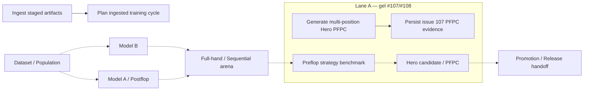

# Audit GitHub Actions — #204 phase 1

Snapshot structurel sur `360d02225ff4ca0aca798f07e3abb87304be88ae`. Cette phase est **audit-only** : aucun fichier `.github/workflows/**` n'est modifié, aucun gate scientifique n'est déclenché ou relâché, et #204 reste ouvert pour la factorisation ultérieure.

## Résumé

- **54 workflows** dans le snapshot rafraîchi ; le 54e (`recover-issue-107-pfpc.yml`) a été ajouté concurremment par lane A après la claim puis intégré en lecture seule.
- **26** groupes avec `cancel-in-progress: true`, **10** avec `false`, **18** sans bloc concurrency.
- Duplication statique minimale : **96 checkouts**, **55 setup-python**, **8 setup-node**, **11 installs pip**, **11 installs Playwright**, **39 uploads** et **40 téléchargements d'artefacts**.
- Sur les **100 runs récents** observés : 80 terminés, 10 annulés, soit **12,5 % d'annulation** parmi les runs terminés.
- `sequential-arena.yml` : 24/100 runs récents, 8 annulations sur 18 terminés.
- 9 couples workflow/branche ont vu à la fois un run `push` et un run `pull_request`.

Les fichiers machine-readable sont `analysis/workflow_audit/workflows.json` et `analysis/workflow_audit/baseline_metrics.json`. L'outil `tools/audit_github_workflows.py` régénère un inventaire détaillé depuis n'importe quel checkout et extrait les filtres `paths` exacts.

## Matrice des workflows

| Workflow | Rôle | Triggers | Scopes de paths | Concurrency | Coût approx. | Cycle |
|---|---|---|---|---|---|---|
| `continuous-training-cycle.yml` | training_orchestration | push, pull_request, workflow_dispatch | `tools`, `tests`, `training`, `.github/workflows` | `continuous-training-cycle-${{ github.ref }}` | medium (10) | current |
| `dataset-integrity.yml` | dataset_population | push, pull_request, workflow_dispatch | `training`, `tools`, `tests`, `.github/workflows` | `${{ github.workflow }}-${{ github.event.pull_request.number \|\| github.ref }}` | low (3) | current |
| `finalize-training-cycle.yml` | training_orchestration | workflow_dispatch, push | `tools`, `training`, `.github/workflows` | `finalize-training-cycle-${{ github.ref }}` | low (7) | historical_candidate |
| `full-hand-arena.yml` | simulation_benchmark | pull_request, workflow_dispatch | `tools`, `tests`, `docs`, `training`, `.github/workflows` | — | medium (16) | current |
| `full-hand-protocol.yml` | simulation_benchmark | pull_request, push, workflow_dispatch | `training`, `tools`, `tests`, `.github/workflows` | — | low (7) | current |
| `game-core.yml` | simulation_benchmark | pull_request, workflow_dispatch | `tools`, `tests`, `docs`, `.github/workflows` | — | low (3) | current |
| `hero-calculated-range-export.yml` | hero_preflop | pull_request, workflow_dispatch | `src`, `site`, `tools`, `tests`, `training`, `docs`, `.github/workflows` | — | medium (9) | current |
| `hero-full-169-evidence.yml` | hero_preflop | pull_request, workflow_dispatch | `tools`, `training`, `.github/workflows` | `hero-full-169-${{ github.event.pull_request.number \|\| github.ref }}` | high (30) | frozen_current |
| `hero-pfpc-evidence-validation.yml` | hero_preflop | pull_request, push | `tools`, `tests`, `training`, `.github/workflows` | — | low (5) | frozen_current |
| `hero-range-compliance.yml` | product_browser_validation | push, pull_request | `site`, `tests`, `tools`, `.github/workflows` | `hero-range-compliance-${{ github.ref }}` | medium (15) | current |
| `hero-range-editor.yml` | product_browser_validation | push, pull_request | `site`, `tests`, `tools`, `.github/workflows` | `hero-range-editor-${{ github.ref }}` | medium (13) | current |
| `hero-range-pfc-context.yml` | hero_preflop | workflow_dispatch, pull_request, push | `site`, `tools`, `tests`, `training`, `.github/workflows` | `hero-range-pfc-context-${{ github.ref }}` | low (5) | current |
| `hero-unopened-multiposition-generation.yml` | hero_preflop | workflow_dispatch, push | branch/manual | `hero-unopened-multiposition-${{ github.ref }}` | high (47) | frozen_current |
| `ingest-artifacts.yml` | dataset_population | push | `artifacts`, `tools`, `tests`, `training`, `.github/workflows` | `artifact-ingest-${{ github.ref }}` | low (3) | current |
| `materialize-certified-population.yml` | dataset_population | push, pull_request | `tools`, `tests`, `training`, `.github/workflows` | `materialize-certified-population-${{ github.ref }}` | medium (10) | current |
| `model-a-continuation.yml` | validation_or_utility | pull_request, push, workflow_dispatch | `tools`, `tests`, `training`, `.github/workflows` | — | low (5) | current |
| `model-b-build.yml` | model_b | workflow_dispatch, push | `tools`, `tests`, `training`, `.github/workflows` | `model-b-build-${{ github.ref }}` | low (7) | historical_candidate |
| `model-b-card-aware-fit.yml` | model_b | workflow_dispatch, push | `training`, `tools`, `tests`, `.github/workflows` | `model-b-card-aware-fit-${{ github.ref }}` | medium (9) | current |
| `model-b-card-aware-runtime.yml` | model_b | push, pull_request | `tools`, `tests`, `training`, `.github/workflows` | — | low (5) | current |
| `model-b-conditioned-runtime.yml` | model_b | workflow_dispatch, push | `tools`, `tests`, `training`, `.github/workflows` | — | low (5) | historical_candidate |
| `model-b-evaluation.yml` | model_b | workflow_dispatch, push | `tools`, `tests`, `training`, `.github/workflows` | `model-b-evaluation-${{ github.ref }}` | medium (8) | historical_candidate |
| `model-b-features.yml` | model_b | push | `tools`, `tests`, `training`, `.github/workflows` | `model-b-features-${{ github.ref }}` | low (3) | historical_candidate |
| `model-b-profile-selection.yml` | model_b | push | `tools`, `training`, `.github/workflows` | `model-b-profile-selection-${{ github.ref }}` | low (3) | historical_candidate |
| `model-b-response-audit.yml` | model_b | workflow_dispatch, push | `tools`, `tests`, `.github/workflows` | — | low (5) | current |
| `model-b-response-v3.yml` | model_b | workflow_dispatch, push | `tools`, `tests`, `.github/workflows` | `model-b-response-v3-${{ github.ref }}` | low (5) | historical_candidate |
| `model-b-reveal-aware.yml` | model_b | pull_request, workflow_dispatch | `tools`, `tests`, `training`, `.github/workflows` | — | low (7) | current |
| `persist-issue-107-pfpc.yml` | validation_or_utility | workflow_run, pull_request, push | `.github/workflows`, `.github/triggers` | `persist-issue-107-pfpc-d7ec5e532dc5` | medium (10) | frozen_current |
| `recover-issue-107-pfpc.yml` | hero_preflop | pull_request, push | `.github/workflows`, `.github/triggers` | `recover-issue-107-pfpc-d7ec5e532dc5` | high (24) | frozen_current |
| `plan-ingested-cycle.yml` | dataset_population | workflow_run, push, pull_request, workflow_dispatch | `training`, `tools`, `tests`, `.github/workflows` | `plan-ingested-cycle-${{ github.event_name == 'workflow_run' && 'main' \|\| github.ref }}` | medium (8) | current |
| `population-certification.yml` | dataset_population | push, pull_request, workflow_dispatch | `training`, `tools`, `tests`, `.github/workflows` | — | low (5) | current |
| `population-pack-catalog.yml` | product_browser_validation | pull_request, workflow_dispatch | `site`, `tools`, `tests`, `user`, `wrangler.jsonc`, `.github/workflows` | `population-pack-catalog-${{ github.ref }}` | medium (17) | current |
| `population-pack.yml` | validation_or_utility | pull_request, push, workflow_dispatch | `tools`, `tests`, `user`, `training`, `site`, `.github/workflows` | — | medium (12) | current |
| `postflop-response-refit.yml` | validation_or_utility | push, pull_request, workflow_dispatch | `tools`, `tests`, `training`, `.github/workflows` | `postflop-continuation-${{ github.ref }}` | low (7) | current |
| `preflop-contract.yml` | preflop_strategy | pull_request, workflow_dispatch | `src`, `tools`, `site`, `tests`, `.github/workflows` | — | low (3) | current |
| `preflop-grid-evaluator.yml` | preflop_strategy | pull_request, workflow_dispatch | `tools`, `src`, `tests`, `docs`, `.github/workflows` | — | low (7) | current |
| `preflop-policy169.yml` | preflop_strategy | pull_request, workflow_dispatch | `tools`, `training`, `tests`, `.github/workflows` | `preflop-policy169-${{ github.ref }}` | low (7) | current |
| `preflop-search.yml` | preflop_strategy | push, pull_request | `src`, `tests`, `docs`, `.github/workflows` | `preflop-search-${{ github.ref }}` | low (5) | current |
| `preflop-strategy-benchmark-v2.yml` | preflop_strategy | workflow_dispatch, pull_request, push | `training`, `tools`, `tests`, `.github/workflows` | `preflop-strategy-benchmark-v2-${{ github.ref }}` | low (7) | frozen_current |
| `preflop-strategy-support-closed.yml` | preflop_strategy | pull_request, push | `training`, `tools`, `tests`, `.github/workflows` | `preflop-strategy-support-closed-${{ github.ref }}` | low (7) | historical_candidate |
| `preflop-strategy-test-pfpc.yml` | preflop_strategy | pull_request, push | `tools`, `tests`, `.github/workflows`, `.github/triggers` | `preflop-strategy-pfpc-test-20260918` | high (46) | frozen_current |
| `preflop-strategy-validation-pfpc.yml` | preflop_strategy | pull_request, push | `tools`, `tests`, `.github/workflows`, `.github/triggers` | `preflop-strategy-pfpc-validation-20260918` | high (41) | frozen_current |
| `preflop-strategy-validation-support-closed.yml` | preflop_strategy | workflow_dispatch, push | branch/manual | `preflop-strategy-validation-support-closed-${{ github.ref }}` | high (31) | historical_candidate |
| `preflop-strategy-validation-v2.yml` | preflop_strategy | workflow_dispatch, push | branch/manual | `preflop-strategy-validation-v2-${{ github.ref }}` | high (31) | historical_candidate |
| `preflop-topology-contract.yml` | preflop_strategy | push, pull_request, workflow_dispatch | `tools`, `tests`, `training`, `.github/workflows` | — | low (3) | current |
| `promotion-gate-final.yml` | release_promotion | workflow_dispatch, push | `training`, `tools`, `tests`, `.github/workflows` | — | low (5) | historical_candidate |
| `release-handoff-contract.yml` | release_promotion | pull_request, push | `training`, `tools`, `tests`, `.github/workflows` | `release-handoff-contract-${{ github.ref }}` | low (5) | current |
| `release-no-pending-snapshot-proof.yml` | release_promotion | pull_request, push | `.github/workflows`, `.github/triggers` | `release-no-pending-snapshot-proof-20260918` | medium (10) | current |
| `sequential-arena.yml` | simulation_benchmark | push, pull_request | `tools`, `tests`, `training`, `site`, `.github/workflows` | `sequential-arena-${{ github.ref }}` | high (41) | current |
| `strategic-benchmark-v3.yml` | simulation_benchmark | workflow_dispatch, push | `tools`, `tests`, `training`, `.github/workflows` | `strategic-benchmark-v3-${{ github.ref }}` | high (39) | historical_candidate |
| `strategy-candidate-v84.yml` | preflop_strategy | workflow_dispatch, push | `training`, `tools`, `tests`, `.github/workflows` | `strategy-candidate-v84-${{ github.ref }}` | medium (16) | historical_candidate |
| `trainer-smoke.yml` | product_browser_validation | push, pull_request | `site`, `tests`, `tools`, `wrangler.jsonc`, `.github/workflows` | `trainer-smoke-${{ github.ref }}` | medium (15) | current |
| `unseen-preflop-context-audit.yml` | preflop_strategy | workflow_dispatch, push | `tools`, `tests`, `.github/workflows` | — | low (7) | historical_candidate |
| `user-artifact-bundle.yml` | validation_or_utility | pull_request, push, workflow_dispatch | `user`, `tools`, `training`, `.github/workflows` | — | low (7) | current |
| `v84-strategy-candidate.yml` | preflop_strategy | workflow_dispatch, push | `tools`, `tests`, `.github/workflows` | `v84-strategy-${{ github.ref }}` | high (36) | historical_candidate |

Le score de coût est un **proxy structurel**, pas une estimation de facturation GitHub : jobs + setup + browser install + transfert d'artefacts, avec pondération des workflows scientifiques.

### Rafraîchissement concurrent

Le snapshot initial a été rafraîchi sur `360d02225ff4ca0aca798f07e3abb87304be88ae`. Les 54 définitions de workflows sont byte-identiques au refresh précédent sur `aff974c…` ; seuls des fichiers hors Actions ont évolué entre-temps. Le nombre de workflows reste **54**. Les **53 autres définitions sont inchangées** ; seul `recover-issue-107-pfpc.yml` (lane A) a évolué, sans changement de rôle ni de statut `frozen_current`. Son filtre de déclenchement inclut désormais aussi `trigger/issue-107-recover-d7ec5e532dc5`.

## Duplications observées

| Primitive | Occurrences |
|---|---:|
| checkout | 96 |
| setup-python | 55 |
| setup-node | 8 |
| pip install | 11 |
| Playwright install | 11 |
| npm install/ci | 0 |
| upload-artifact | 39 |
| download-artifact / gh run download | 40 |

Les répétitions les plus rentables à factoriser après dégel sont : setup Python verrouillé (#203), installation Playwright/Chromium, browser smoke statique, upload/download fan-out/fan-in et capture d'identité d'environnement.

## Concurrency : collisions et annulations

1. Les groupes du type `<workflow>-${{ github.ref }}` annulent efficacement des pushes successifs d'une même ref.
2. Ils ne dédupliquent **pas** le couple `push` + `pull_request` d'une même branche, car les refs GitHub diffèrent. Les 100 derniers runs montrent ce motif sur Trainer, Hero compliance/editor et Sequential Arena.
3. Les workflows scientifiques PFPC #107/#108 utilisent volontairement des groupes fixes ou `cancel-in-progress: false`; **ne pas les modifier pendant le gel**.
4. Aucun groupe statique identique n'est partagé entre deux workflows de ce snapshot ; le problème principal est donc intra-workflow (rafales) et inter-trigger (push+PR), pas une collision accidentelle entre deux responsabilités différentes.
5. `sequential-arena.yml` est le hotspot : 11 annulations sur 21 runs terminés dans l'échantillon récent.

## Workflows historiques / candidats à archivage

- `.github/workflows/finalize-training-cycle.yml` — candidat à gel/archivage : workflow daté/versionné ou prédécesseur d'une chaîne plus récente. Vérifier les références d'artefacts et validateurs avant désactivation.
- `.github/workflows/model-b-build.yml` — candidat à gel/archivage : workflow daté/versionné ou prédécesseur d'une chaîne plus récente. Vérifier les références d'artefacts et validateurs avant désactivation.
- `.github/workflows/model-b-conditioned-runtime.yml` — candidat à gel/archivage : workflow daté/versionné ou prédécesseur d'une chaîne plus récente. Vérifier les références d'artefacts et validateurs avant désactivation.
- `.github/workflows/model-b-evaluation.yml` — candidat à gel/archivage : workflow daté/versionné ou prédécesseur d'une chaîne plus récente. Vérifier les références d'artefacts et validateurs avant désactivation.
- `.github/workflows/model-b-features.yml` — candidat à gel/archivage : workflow daté/versionné ou prédécesseur d'une chaîne plus récente. Vérifier les références d'artefacts et validateurs avant désactivation.
- `.github/workflows/model-b-profile-selection.yml` — candidat à gel/archivage : workflow daté/versionné ou prédécesseur d'une chaîne plus récente. Vérifier les références d'artefacts et validateurs avant désactivation.
- `.github/workflows/model-b-response-v3.yml` — candidat à gel/archivage : workflow daté/versionné ou prédécesseur d'une chaîne plus récente. Vérifier les références d'artefacts et validateurs avant désactivation.
- `.github/workflows/preflop-strategy-support-closed.yml` — candidat à gel/archivage : workflow daté/versionné ou prédécesseur d'une chaîne plus récente. Vérifier les références d'artefacts et validateurs avant désactivation.
- `.github/workflows/preflop-strategy-validation-support-closed.yml` — candidat à gel/archivage : workflow daté/versionné ou prédécesseur d'une chaîne plus récente. Vérifier les références d'artefacts et validateurs avant désactivation.
- `.github/workflows/preflop-strategy-validation-v2.yml` — candidat à gel/archivage : workflow daté/versionné ou prédécesseur d'une chaîne plus récente. Vérifier les références d'artefacts et validateurs avant désactivation.
- `.github/workflows/promotion-gate-final.yml` — candidat à gel/archivage : workflow daté/versionné ou prédécesseur d'une chaîne plus récente. Vérifier les références d'artefacts et validateurs avant désactivation.
- `.github/workflows/strategic-benchmark-v3.yml` — candidat à gel/archivage : workflow daté/versionné ou prédécesseur d'une chaîne plus récente. Vérifier les références d'artefacts et validateurs avant désactivation.
- `.github/workflows/strategy-candidate-v84.yml` — candidat à gel/archivage : workflow daté/versionné ou prédécesseur d'une chaîne plus récente. Vérifier les références d'artefacts et validateurs avant désactivation.
- `.github/workflows/unseen-preflop-context-audit.yml` — candidat à gel/archivage : workflow daté/versionné ou prédécesseur d'une chaîne plus récente. Vérifier les références d'artefacts et validateurs avant désactivation.
- `.github/workflows/v84-strategy-candidate.yml` — candidat à gel/archivage : workflow daté/versionné ou prédécesseur d'une chaîne plus récente. Vérifier les références d'artefacts et validateurs avant désactivation.

Ce classement est volontairement `historical_candidate`, pas `obsolete=true` : la preuve scientifique historique doit rester référencée et non réécrite.

## Workflows gelés actuels

- `.github/workflows/hero-full-169-evidence.yml`
- `.github/workflows/hero-pfpc-evidence-validation.yml`
- `.github/workflows/hero-unopened-multiposition-generation.yml`
- `.github/workflows/persist-issue-107-pfpc.yml`
- `.github/workflows/preflop-strategy-benchmark-v2.yml`
- `.github/workflows/preflop-strategy-test-pfpc.yml`
- `.github/workflows/preflop-strategy-validation-pfpc.yml`
- `.github/workflows/recover-issue-107-pfpc.yml`

Ils sont exclus de toute factorisation dans cette phase.

## DAG lisible

Traits pleins : dépendances GitHub `workflow_run` explicites. Traits pointillés : chaîne de données/responsabilités conceptuelle, **pas** une dépendance d'exécution implicite.



## Reusable workflows/actions proposés — phase 2 uniquement

| Brique future | Cible | Gain attendu | Garde-fou |
|---|---|---|---|
| `setup-repro-environment` | checkout + Python/Node + lock #203 | retire des dizaines de setup dupliqués | version exacte, manifeste d'environnement |
| `python-contract` | checkout/setup + suite Python déterministe | réduit boilerplate des contrats simples | commande de test explicite, aucun seuil scientifique déplacé |
| `browser-smoke` | Playwright/Chromium + serveur statique + smoke | mutualise 11 installs browser | version Playwright/Chromium verrouillée |
| `artifact-fanout-fanin` | shards + upload/download + merge | réduit la duplication des gros workflows | noms d'artefacts stables et SHA vérifiés |
| `scientific-run-identity` | code/data/model/env fingerprints | cohérence #203 + runs | append-only, aucune réécriture historique |
| `release-contract` | validations de handoff/promotion | simplifie orchestration release | ne rend aucun gate optionnel |

Aucune de ces briques n'est créée dans la phase audit afin d'éviter un changement fonctionnel d'Actions avant la libération de #107/#108.

## Métriques avant/après

Baseline : `analysis/workflow_audit/baseline_metrics.json`.

Après factorisation, recalculer sur le même protocole :
- nombre de workflows et de jobs déclenchés par classe de changement ;
- runs pour 100 événements comparables ;
- taux d'annulation des runs terminés ;
- couples workflow/branche ayant simultanément `push` et `pull_request`;
- occurrences checkout/setup/install/upload/download ;
- médiane de durée murale par workflow ;
- conservation exacte des jobs/gates/artefacts scientifiques attendus.

Les classes représentatives sont Central UI, Hero editor, Model B/simulation, dataset/training et docs-only.

## Coûts structurels élevés

- `.github/workflows/hero-full-169-evidence.yml` — score 30
- `.github/workflows/hero-unopened-multiposition-generation.yml` — score 47
- `.github/workflows/preflop-strategy-test-pfpc.yml` — score 46
- `.github/workflows/preflop-strategy-validation-pfpc.yml` — score 41
- `.github/workflows/preflop-strategy-validation-support-closed.yml` — score 31
- `.github/workflows/preflop-strategy-validation-v2.yml` — score 31
- `.github/workflows/sequential-arena.yml` — score 41
- `.github/workflows/strategic-benchmark-v3.yml` — score 39
- `.github/workflows/v84-strategy-candidate.yml` — score 36

- `.github/workflows/recover-issue-107-pfpc.yml` — score 24

## Validation de l'audit

```bash
python3 -m py_compile tools/audit_github_workflows.py tests/test_github_workflow_audit.py
python3 tests/test_github_workflow_audit.py
python3 tools/audit_github_workflows.py --json /tmp/workflows.json
```

Les tests dédiés couvrent parsing des paths, jobs/needs, concurrency, artefacts, coût et dépendances `workflow_run`.
